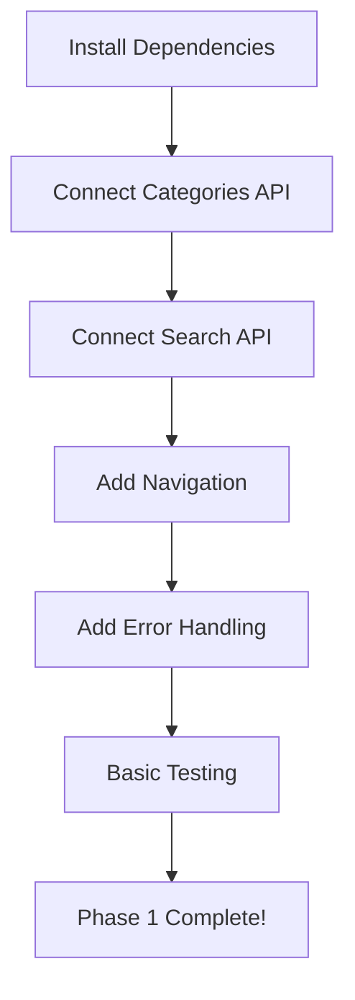

# Search Page Implementation Summary

## 📋 Executive Summary

Transform the search page from **dummy data prototype** to **production-ready feature** by:
1. ✅ **Backend Integration** - All APIs available, just need to connect
2. ✅ **Navigation** - Link search to product/store/category pages
3. ✅ **Filters & Sorting** - Add advanced search capabilities
4. ✅ **Performance** - Optimize for speed and UX

**Total Effort:** 3 weeks | **Priority:** HIGH | **Risk:** LOW

---

## 🎯 What We're Building

### Current State (Prototype)
```
User → Search Page → Dummy Data → No Navigation
                   → Fake Categories
                   → Mock Results
```

### Target State (Production)
```
User → Search Page → Real API → Products/Stores
                              → Product Page
                              → Store Page
                              → Category Page
     → Filters → Advanced Search → Filtered Results
     → History → Recent Searches
     → Analytics → Usage Tracking
```

---

## 📊 Gap Analysis

| Feature | Current | Target | Status |
|---------|---------|--------|--------|
| **API Integration** | Dummy data | Live backend | 🔴 Critical |
| **Navigation** | None | Full routing | 🔴 Critical |
| **Filters** | UI only | Functional | 🟡 Important |
| **Sorting** | Fake | Real API | 🟡 Important |
| **History** | None | AsyncStorage | 🟡 Important |
| **Suggestions** | Static | Dynamic API | 🟢 Nice-to-have |
| **Analytics** | None | Full tracking | 🟢 Nice-to-have |
| **Caching** | None | Redis + Local | 🟢 Nice-to-have |

---

## 🛠️ Files Breakdown

### Files to CREATE (New Files)

#### Pages (2 files)
1. **`frontend/app/category/[slug].tsx`** - Category products page
   - Shows all products in a category
   - Filters, sorting, pagination
   - ~300 lines

2. **`frontend/app/category/all.tsx`** - All categories view
   - Grid of all categories
   - Filter by type (going_out/home_delivery)
   - ~200 lines

#### Components (10 files)
3. **`frontend/components/search/FilterModal.tsx`** - Filter selection
   - Price range, rating, categories
   - ~400 lines

4. **`frontend/components/search/SortModal.tsx`** - Sort options
   - Simple modal with sort options
   - ~150 lines

5. **`frontend/components/search/ProductResultCard.tsx`** - Product card
   - Enhanced result card for products
   - ~200 lines

6. **`frontend/components/search/StoreResultCard.tsx`** - Store card
   - Enhanced result card for stores
   - ~200 lines

7. **`frontend/components/search/CombinedResultsView.tsx`** - Combined view
   - Shows products + stores together
   - ~300 lines

8. **`frontend/components/search/ErrorState.tsx`** - Error UI
   - Network errors, API errors, etc.
   - ~150 lines

9. **`frontend/components/search/EmptyState.tsx`** - Empty states
   - No results, no history, etc.
   - ~150 lines

10. **`frontend/components/search/RecentSearches.tsx`** - Recent searches
    - Display search history
    - ~200 lines

11. **`frontend/components/search/TrendingSearches.tsx`** - Trending
    - Popular searches
    - ~150 lines

12. **`frontend/components/search/SearchSkeleton.tsx`** - Loading skeleton
    - Shimmer loading effect
    - ~150 lines

#### Services (3 files)
13. **`frontend/services/searchHistoryService.ts`** - History management
    - Save/load search history
    - ~200 lines

14. **`frontend/services/searchAnalytics.ts`** - Analytics tracking
    - Track search events
    - ~150 lines

15. **`frontend/utils/searchHelpers.ts`** - Helper functions
    - Data transformations, utilities
    - ~200 lines

#### Hooks (3 files)
16. **`frontend/hooks/useSearchHistory.ts`** - History hook
    - React hook for search history
    - ~100 lines

17. **`frontend/hooks/useSearchFilters.ts`** - Filter hook
    - React hook for filters management
    - ~150 lines

18. **`frontend/hooks/useDebouncedSearch.ts`** - Debounced search
    - Debounce search input
    - ~50 lines

**Total New Files: 18 files (~3,450 lines)**

---

### Files to UPDATE (Existing Files)

#### Core Files (4 files)
1. **`frontend/app/search.tsx`** - Main search page
   - Replace dummy data with API calls
   - Add navigation
   - Add error handling
   - Integrate new components
   - **Changes:** ~60% rewrite (~400 lines)

2. **`frontend/types/search.types.ts`** - Type definitions
   - Add missing types
   - Update interfaces
   - **Changes:** ~20% additions (~50 lines)

3. **`frontend/services/searchApi.ts`** - API service
   - Already good, minor enhancements
   - **Changes:** ~10% additions (~30 lines)

4. **`frontend/hooks/useSearch.ts`** - Search hook
   - Add filter/sort support
   - **Changes:** ~20% additions (~50 lines)

#### Components (4 files)
5. **`frontend/components/search/SearchHeader.tsx`** - Header
   - Add voice search button
   - Improve UX
   - **Changes:** ~15% additions (~30 lines)

6. **`frontend/components/search/CategoryCard.tsx`** - Category card
   - Add loading states
   - **Changes:** ~10% additions (~20 lines)

7. **`frontend/components/search/SearchSection.tsx`** - Section
   - Add error handling
   - **Changes:** ~10% additions (~15 lines)

8. **`frontend/components/search/index.ts`** - Exports
   - Export new components
   - **Changes:** ~50% additions (~10 lines)

#### Data (1 file)
9. **`frontend/data/searchData.ts`** - Dummy data
   - Keep as fallback
   - Mark as deprecated
   - **Changes:** ~5% additions (~20 lines)

**Total Files to Update: 9 files (~625 lines changed)**

---

## 📦 Dependencies to Add

```json
{
  "dependencies": {
    "use-debounce": "^9.0.4",
    "react-native-fast-image": "^8.6.3"
  },
  "devDependencies": {
    "@types/use-debounce": "^9.0.0"
  }
}
```

**Installation:**
```bash
npm install use-debounce react-native-fast-image
npm install --save-dev @types/use-debounce
```

---

## 🗺️ Implementation Roadmap

### Week 1: Core Functionality (Days 1-5)
**Goal:** Get search working with real data

#### Day 1-2: Backend Integration
- [ ] Connect to categories API
- [ ] Connect to search API
- [ ] Map backend data to UI types
- [ ] Test basic search flow

#### Day 3-4: Navigation
- [ ] Create category page
- [ ] Add navigation to products
- [ ] Add navigation to stores
- [ ] Test all navigation paths

#### Day 5: Error Handling & Polish
- [ ] Add error states
- [ ] Add loading states
- [ ] Add empty states
- [ ] Test error scenarios

**Deliverable:** Working search with real data ✅

---

### Week 2: Enhanced Features (Days 6-10)

#### Day 6-7: Filters & Sorting
- [ ] Create FilterModal component
- [ ] Create SortModal component
- [ ] Connect to API
- [ ] Test filter combinations

#### Day 8-9: Search History
- [ ] Create history service
- [ ] Create RecentSearches component
- [ ] Implement save/load
- [ ] Test persistence

#### Day 10: Combined Results
- [ ] Create result cards
- [ ] Create combined view
- [ ] Implement pagination
- [ ] Test scroll performance

**Deliverable:** Full-featured search experience ✅

---

### Week 3: Optimization & Advanced (Days 11-15)

#### Day 11-12: Performance
- [ ] Implement caching
- [ ] Add debouncing
- [ ] Optimize images
- [ ] Virtualize lists

#### Day 13: Analytics
- [ ] Add event tracking
- [ ] Implement search analytics
- [ ] Test tracking flow

#### Day 14: Testing
- [ ] Unit tests
- [ ] Integration tests
- [ ] E2E tests
- [ ] Performance tests

#### Day 15: Launch Prep
- [ ] Code review
- [ ] Documentation
- [ ] Production deployment
- [ ] Monitor metrics

**Deliverable:** Production-ready search ✅

---

## 🎯 Success Metrics

### Technical Metrics
- ✅ Search response time < 500ms
- ✅ 99.5% crash-free rate
- ✅ Cache hit rate > 60%
- ✅ Bundle size < 500KB

### User Metrics
- ✅ Search success rate > 80%
- ✅ 2-3 searches per session
- ✅ Search-to-purchase > 15%

### Business Metrics
- ✅ +25% product discovery
- ✅ -20% bounce rate
- ✅ +15% session duration

---

## 🔥 Critical Path (Must Do First)



### Minimum Viable Product (MVP)
To get search working, you MUST do:
1. ✅ Install dependencies (5 min)
2. ✅ Connect categories API (30 min)
3. ✅ Connect search API (30 min)
4. ✅ Add navigation (20 min)
5. ✅ Add error handling (15 min)

**Total MVP Time: ~2 hours**

After MVP, search is functional! Everything else is enhancement.

---

## 🧪 Testing Strategy

### Unit Tests (Week 3, Day 14)
- [ ] searchApi methods
- [ ] searchHistoryService
- [ ] Filter conversion logic
- [ ] Helper functions

### Integration Tests (Week 3, Day 14)
- [ ] Search flow
- [ ] Filter application
- [ ] Sort changes
- [ ] Pagination

### E2E Tests (Week 3, Day 14)
- [ ] Complete user journey
- [ ] Error handling
- [ ] Performance under load

---

## 📞 Backend APIs (All Ready!)

### Categories
```typescript
GET /api/categories?type=going_out,home_delivery&featured=true
Response: {
  success: true,
  data: Array<{
    _id: string,
    name: string,
    slug: string,
    type: 'going_out' | 'home_delivery',
    image: string,
    description: string,
    cashbackPercentage: number,
    isFeatured: boolean
  }>
}
```

### Product Search
```typescript
GET /api/products/search?q=query&category=id&page=1&limit=20
Response: {
  success: true,
  data: {
    products: Array<ProductSearchResult>,
    pagination: {
      page: number,
      limit: number,
      total: number,
      pages: number
    },
    filters: {
      categories: Array<{ id, name, count }>,
      brands: Array<{ name, count }>,
      priceRange: { min, max }
    }
  }
}
```

### Store Search
```typescript
GET /api/stores/search?q=query&page=1&limit=20
Response: {
  success: true,
  data: {
    stores: Array<StoreSearchResult>,
    pagination: { page, limit, total, pages }
  }
}
```

---

## ⚠️ Common Pitfalls to Avoid

### 1. Don't Over-Engineer
❌ Don't build everything at once
✅ Do: Phase 1 → Test → Phase 2 → Test

### 2. Don't Skip Error Handling
❌ Don't assume API always works
✅ Do: Add error states from Day 1

### 3. Don't Ignore Performance
❌ Don't load 1000 results at once
✅ Do: Implement pagination early

### 4. Don't Forget Analytics
❌ Don't skip tracking
✅ Do: Add analytics from start

---

## 🚀 Quick Start Commands

```bash
# 1. Install dependencies
cd frontend
npm install use-debounce react-native-fast-image

# 2. Start development
npx expo start

# 3. Test backend APIs
curl http://localhost:5000/api/categories?type=going_out
curl "http://localhost:5000/api/products/search?q=phone"

# 4. Run tests
npm test

# 5. Build for production
npm run build
```

---

## 📚 Documentation

### Required Documentation
- [ ] API integration guide
- [ ] Component usage guide
- [ ] Testing guide
- [ ] Deployment guide

### User Documentation
- [ ] Search tips
- [ ] Filter guide
- [ ] FAQ

---

## ✨ Future Enhancements (Post-Launch)

### Phase 4: Advanced Features
- Voice search
- Barcode scanner
- Visual search (image)
- AI recommendations

### Phase 5: Internationalization
- Multi-language support
- Currency conversion
- Regional categories

### Phase 6: Personalization
- ML-powered suggestions
- User preference learning
- Smart recommendations

---

## 🎉 You're All Set!

### Next Steps:
1. 📖 Read `SEARCH_PAGE_QUICK_START.md` for immediate actions
2. 📋 Read `SEARCH_PAGE_PRODUCTION_PLAN.md` for detailed specs
3. 🚀 Start with Phase 1, Step 1
4. ✅ Check off items as you complete them

### Need Help?
- Refer to the detailed plan for implementation details
- Check the quick start guide for common issues
- All backend APIs are documented and ready
- Types are already defined

**Estimated Total Time:** 3 weeks
**Difficulty:** Medium
**Risk Level:** Low (all APIs ready!)

Good luck! 🚀


